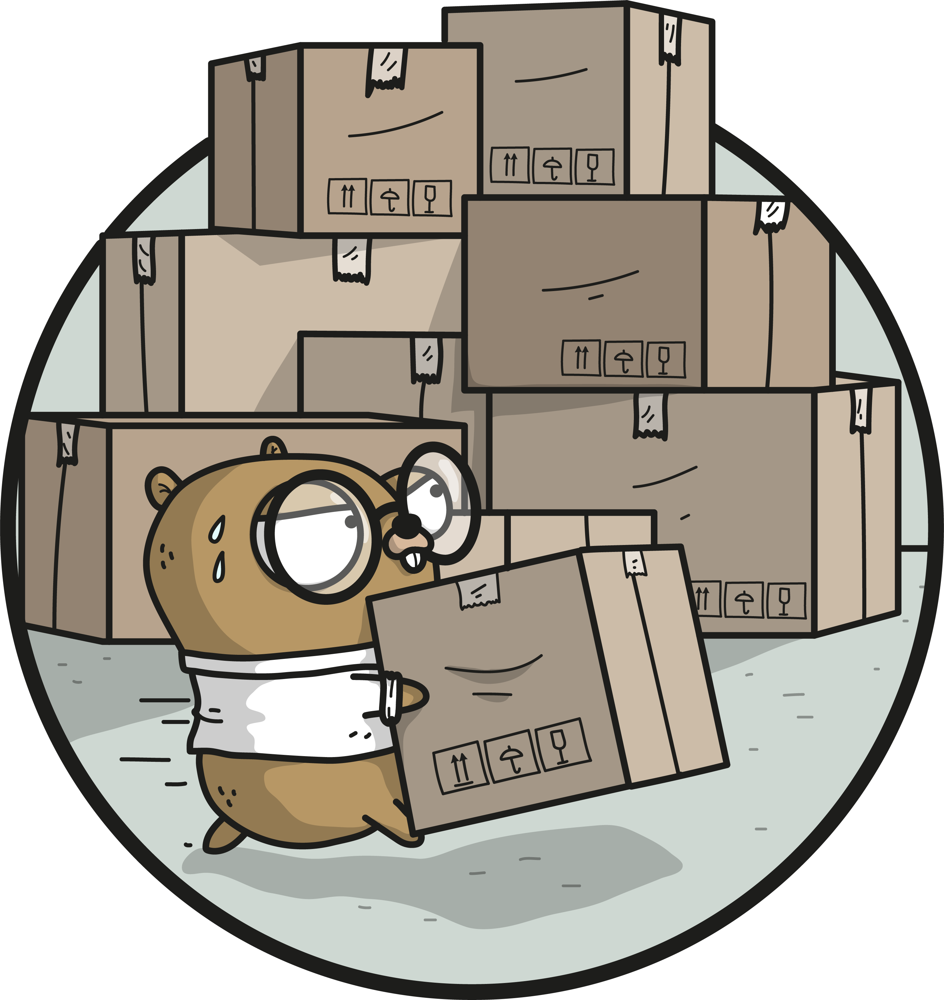
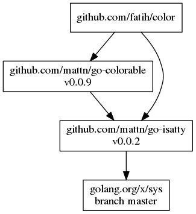

<p align="center"></p>
<p align="center">
  <a href="https://travis-ci.org/golang/dep"></img></a>
  <a href="https://ci.appveyor.com/project/golang/dep"></a>
  <a href="https://codeclimate.com/github/golang/dep"></img></a>
  <a href="https://codeclimate.com/github/golang/dep/coverage"></a>
</p>

## Dep

`dep` is a prototype dependency management tool for Go. It requires Go 1.8 or newer to compile.

`dep` is the official _experiment_, but not yet the official tool. Check out the [Roadmap](https://github.com/golang/dep/wiki/Roadmap) for more on what this means!

## Current status

`dep` is safe for production use. That means two things:

* Any valid metadata file (`Gopkg.toml` and `Gopkg.lock`) will be readable and considered valid by any future version of `dep`.
* The CLI UI is mostly stable. `dep init` and `dep ensure` are mostly set; `dep status` is likely to change a fair bit, and `dep prune` is [going to be absorbed into `dep ensure`](https://github.com/golang/dep/issues/944).

That said, keep in mind the following:

* `dep init` on an existing project can be a rocky experience - we try to automatically convert from other tools' metadata files, and that process is often complex and murky. Once your project is converted and you're using `dep ensure`, its behavior is quite stable.
* `dep` still has nasty bugs, but in general these are comparable to or fewer than other tools out there.
* `dep` is [pretty slow right now](https://github.com/golang/dep/blob/master/docs/FAQ.md#why-is-dep-slow), especially on the first couple times you run it. Just know that there is a _lot_ of headroom for improvement, and work is actively underway.
* `dep` is still changing rapidly. If you need stability (e.g. for CI), it's best to rely on a released version, not tip.
* `dep`'s exported API interface will continue to change in unpredictable, backwards-incompatible ways until we tag a v1.0.0 release.

## Context

- [The Saga of Go Dependency Management](https://blog.gopheracademy.com/advent-2016/saga-go-dependency-management/)
- Official Google Docs
  - [Go Packaging Proposal Process](https://docs.google.com/document/d/18tNd8r5DV0yluCR7tPvkMTsWD_lYcRO7NhpNSDymRr8/edit)
  - [User Stories](https://docs.google.com/document/d/1wT8e8wBHMrSRHY4UF_60GCgyWGqvYye4THvaDARPySs/edit)
  - [Features](https://docs.google.com/document/d/1JNP6DgSK-c6KqveIhQk-n_HAw3hsZkL-okoleM43NgA/edit)
  - [Design Space](https://docs.google.com/document/d/1TpQlQYovCoX9FkpgsoxzdvZplghudHAiQOame30A-v8/edit)
- [Frequently Asked Questions](docs/FAQ.md)

## Setup

Grab the latest binary from the [releases](https://github.com/golang/dep/releases) page.

On macOS you can install or upgrade to the latest released version with Homebrew:

```sh
$ brew install dep
$ brew upgrade dep
```

If you're interested in hacking on `dep`, you can install via `go get`:

```sh
go get -u github.com/golang/dep/cmd/dep
```

To start managing dependencies using dep, run the following from your project's root directory:

```sh
$ dep init
```

This does the following:

1. Look for [existing dependency management files](docs/FAQ.md#what-external-tools-are-supported) to convert
1. Check if your dependencies use dep
1. Identify your dependencies
1. Back up your existing `vendor/` directory (if you have one) to
`_vendor-TIMESTAMP/`
1. Pick the highest compatible version for each dependency
1. Generate [`Gopkg.toml`](docs/Gopkg.toml.md) ("manifest") and `Gopkg.lock` files
1. Install the dependencies in `vendor/`

## Usage

There is one main subcommand you will use: `dep ensure`. `ensure` first checks that `Gopkg.lock` is consistent with `Gopkg.toml` and the `import`s in your code. If any
changes are detected, `dep`'s solver works out a new `Gopkg.lock`. Then, `dep` checks if the contents of `vendor/` are what `Gopkg.lock` (the new one if applicable, else the existing one) says it should be, and rewrites `vendor/` as needed to bring it into line.

In essence, `dep ensure` [works in two phases to keep four buckets of state in sync](https://youtu.be/5LtMb090AZI?t=20m4s):


_Note: until we ship [vendor verification](https://github.com/golang/dep/issues/121), we can't efficiently perform the `Gopkg.lock` <-> `vendor/` comparison, so `dep ensure` unconditionally regenerates all of `vendor/` to be safe._

`dep ensure` is safe to run early and often. See the help text for more detailed
usage instructions.

```sh
$ dep help ensure
```

### Installing dependencies

(if your `vendor/` directory isn't [checked in with your code](docs/FAQ.md#should-i-commit-my-vendor-directory))

<!-- may change with https://github.com/golang/dep/pull/489 -->

```sh
$ dep ensure
```

If a dependency already exists in your `vendor/` folder, dep will ensure it
matches the constraints from the manifest. If the dependency is missing from
`vendor/`, the latest version allowed by your manifest will be installed.

### Adding a dependency

```sh
$ dep ensure -add github.com/foo/bar
```

This adds a version constraint to your `Gopkg.toml`, and updates `Gopkg.lock` and `vendor/`. Now, import and use the package in your code! ✨

`dep ensure -add` has some subtle behavior variations depending on the project or package named, and the state of your tree. See `dep ensure -examples` for more information.

### Changing dependencies

If you want to:

* Change the allowed `version`/`branch`/`revision`
* Switch to using a fork

for one or more dependencies, do the following:

1. Manually edit your `Gopkg.toml`.
1. Run

    ```sh
    $ dep ensure
    ```

### Checking the status of dependencies

Run `dep status` to see the current status of all your dependencies.

```sh
$ dep status
PROJECT                             CONSTRAINT     VERSION        REVISION  LATEST
github.com/Masterminds/semver       branch 2.x     branch 2.x     139cc09   c2e7f6c
github.com/Masterminds/vcs          ^1.11.0        v1.11.1        3084677   3084677
github.com/armon/go-radix           *              branch master  4239b77   4239b77
```

On top of that, if you have added new imports to your project or modified `Gopkg.toml` without running `dep ensure` again, `dep status` will tell you there is a mismatch between `Gopkg.lock` and the current status of the project.

```sh
$ dep status
Lock inputs-digest mismatch due to the following packages missing from the lock:

PROJECT                         MISSING PACKAGES
github.com/Masterminds/goutils  [github.com/Masterminds/goutils]

This happens when a new import is added. Run `dep ensure` to install the missing packages.
```

As `dep status` suggests, run `dep ensure` to update your lockfile. Then run `dep status` again, and the lock mismatch should go away.

### Visualizing dependencies

Generate a visual representation of the dependency tree by piping the output of `dep status -dot` to [graphviz](http://www.graphviz.org/).
#### Linux
```
$ sudo apt-get install graphviz
$ dep status -dot | dot -T png | display
```
#### MacOS
```
$ brew install graphviz
$ dep status -dot | dot -T png | open -f -a /Applications/Preview.app
```
#### Windows
```
> choco install graphviz.portable
> dep status -dot | dot -T png -o status.png; start status.png
```
<p align="center"></p>

### Updating dependencies

Updating brings the version of a dependency in `Gopkg.lock` and `vendor/` to the latest version allowed by the constraints in `Gopkg.toml`.

You can update just a targeted subset of dependencies (recommended):

```sh
$ dep ensure -update github.com/some/project github.com/other/project
$ dep ensure -update github.com/another/project
```

Or you can update all your dependencies at once:

```sh
$ dep ensure -update
```

"Latest" means different things depending on the type of constraint in use. If you're depending on a `branch`, `dep` will update to the latest tip of that branch. If you're depending on a `version` using [a semver range](#semantic-versioning), it will update to the latest version in that range.

### Removing dependencies

1. Remove the `import`s and all usage from your code.
1. Remove `[[constraint]]` rules from `Gopkg.toml` (if any).
1. Run

    ```sh
    $ dep ensure
    ```

### Testing changes to a dependency

Making changes in your `vendor/` directory directly is not recommended, as dep
will overwrite any changes. Instead:

1. Delete the dependency from the `vendor/` directory.

    ```sh
    rm -rf vendor/<dependency>
    ```

1. Add that dependency to your `GOPATH`, if it isn't already.

    ```sh
    $ go get <dependency>
    ```

1. Modify the dependency in `$GOPATH/src/<dependency>`.
1. Test, build, etc.

Don't run `dep ensure` until you're done. `dep ensure` will reinstall the
dependency into `vendor/` based on your manifest, as if you were installing from
scratch.

This solution works for short-term use, but for something long-term, take a look
at [virtualgo](https://github.com/GetStream/vg).

To test out code that has been pushed as a new version, or to a branch or fork,
see [changing dependencies](#changing-dependencies).

## Semantic Versioning

`dep ensure` uses an external [semver library](https://github.com/Masterminds/semver) to interpret the version constraints you specify in the manifest. The comparison operators are:

* `=`: equal
* `!=`: not equal
* `>`: greater than
* `<`: less than
* `>=`: greater than or equal to
* `<=`: less than or equal to
* `-`: literal range. Eg: 1.2 - 1.4.5 is equivalent to >= 1.2, <= 1.4.5
* `~`: minor range. Eg: ~1.2.3 is equivalent to >= 1.2.3, < 1.3.0
* `^`: major range. Eg: ^1.2.3 is equivalent to >= 1.2.3, < 2.0.0
* `[xX*]`: wildcard. Eg: 1.2.x is equivalent to >= 1.2.0, < 1.3.0

You might, for example, include a constraint in your manifest that specifies `version = "=2.0.0"` to pin a dependency to version 2.0.0, or constrain to minor releases with: `version = "2.*"`. Refer to the [semver library](https://github.com/Masterminds/semver) documentation for more info.

**Note**: When you specify a version *without an operator*, `dep` automatically uses the `^` operator by default. `dep ensure` will interpret the given version as the min-boundary of a range, for example:

* `1.2.3` becomes the range `>=1.2.3, <2.0.0`
* `0.2.3` becomes the range `>=0.2.3, <0.3.0`
* `0.0.3` becomes the range `>=0.0.3, <0.1.0`

## Feedback

Feedback is greatly appreciated.
At this stage, the maintainers are most interested in feedback centered on the user experience (UX) of the tool.
Do you have workflows that the tool supports well, or doesn't support at all?
Do any of the commands have surprising effects, output, or results?
Please check the existing issues and [FAQ](docs/FAQ.md) to see if your feedback has already been reported.
If not, please file an issue, describing what you did or wanted to do, what you expected to happen, and what actually happened.

## Contributing

Contributions are greatly appreciated.
The maintainers actively manage the issues list, and try to highlight issues suitable for newcomers.
The project follows the typical GitHub pull request model.
See [CONTRIBUTING.md](CONTRIBUTING.md) for more details.
Before starting any work, please either comment on an existing issue, or file a new one.
