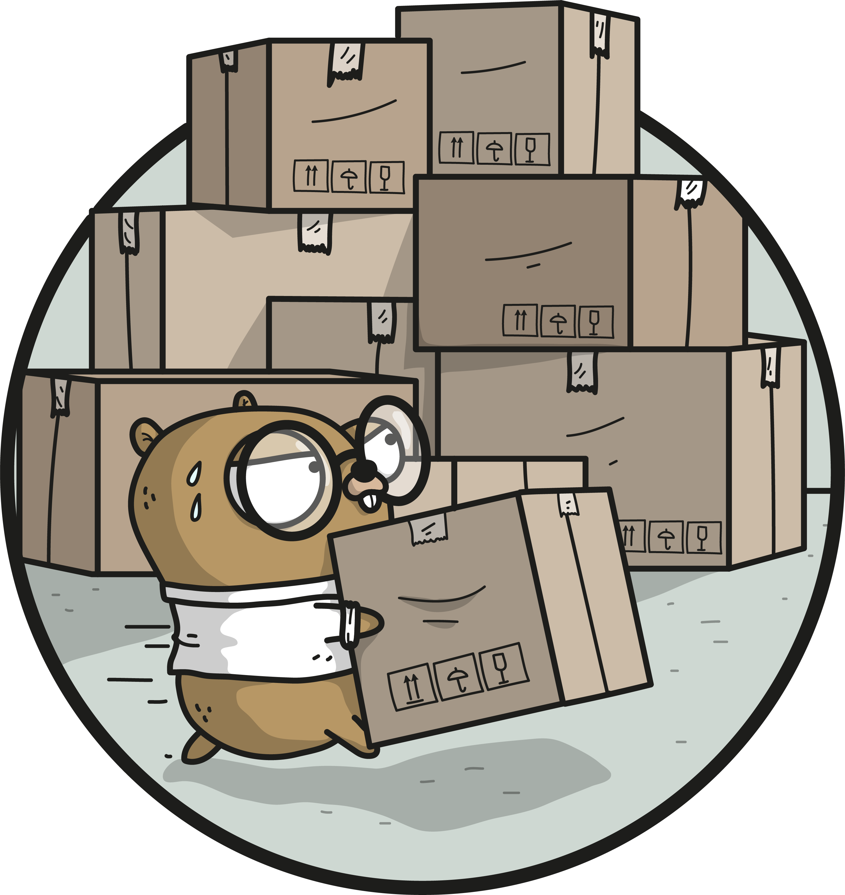

<p align="center"></p>
<p align="center">
  <a href="https://travis-ci.org/golang/dep"></img></a>
  <a href="https://ci.appveyor.com/project/golang/dep"></a>
  <a href="https://goreportcard.com/report/github.com/golang/dep"></a>
</p>

## Dep

`dep` is a prototype dependency management tool for Go. It requires Go 1.9 or newer to compile. **`dep` is safe for production use.**

`dep` is the official _experiment_, but not yet the official tool. Check out the [Roadmap](https://github.com/golang/dep/wiki/Roadmap) for more on what this means!

For guides and reference materials about `dep`, see [the documentation](https://golang.github.io/dep).

## Installation

It is strongly recommended that you use a released version. Release binaries are available on the [releases](https://github.com/golang/dep/releases) page.

On MacOS you can install or upgrade to the latest released version with Homebrew:

```sh
$ brew install dep
$ brew upgrade dep
```

On other platforms you can use the `install.sh` script:

```sh
$ curl https://raw.githubusercontent.com/golang/dep/master/install.sh | sh
```

It will install into your `$GOPATH/bin` directory by default or any other directory you specify using the `INSTALL_DIRECTORY` environment variable.

If your platform is not supported, you'll need to build it manually or let the team know and we'll consider adding your platform
to the release builds.

If you're interested in hacking on `dep`, you can install via `go get`:

```sh
go get -u github.com/golang/dep/cmd/dep
```

## Feedback

Feedback is greatly appreciated.
At this stage, the maintainers are most interested in feedback centered on the user experience (UX) of the tool.
Do you have workflows that the tool supports well, or doesn't support at all?
Do any of the commands have surprising effects, output, or results?
Let us know by filing an issue, describing what you did or wanted to do, what you expected to happen, and what actually happened.

## Contributing

Contributions are greatly appreciated.
The maintainers actively manage the issues list, and try to highlight issues suitable for newcomers.
The project follows the typical GitHub pull request model.
See [CONTRIBUTING.md](CONTRIBUTING.md) for more details.
Before starting any work, please either comment on an existing issue, or file a new one.
