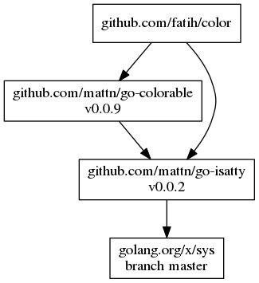

This guide is an introduction to the day-to-day use of dep. If you haven't set up a Go project at all yet, though, run through [Creating a New Project](new-project.md) first.

Dep is a tool you'll use regularly in the course of normal Go development. Regularly, but briefly - dependency management is never the place we want to be spending our time or energy! In keeping with Go's philosophy of minimizing knobs, dep has a sparse interface; there are only two commands you're likely to run regularly:

* `dep ensure` is the primary workhorse command, and is the only command that changes disk state.
* `dep status` reports on the state of your project, and the visible universe of Go software projects.

This guide primarily centers on `dep ensure`, as that's the command you run to effect changes on your project. The [Models and Mechanisms](ensure-mechanics.md) reference document details how the things work under the hood, and is worth reading if you're encountering a confusing `dep ensure` behavior (or just curious!).

## Basics

Let's start with words!

Dep's main command is `dep ensure`. The verb is "ensure" to imply that the action is not just some single, discrete action (like adding a dependency), but enforcing some kind of broader guarantee. If we wanted to express the `dep ensure` guarantee as a sentence, it would go something like this:

> Hey dep, please make sure that [my project](glossary.md#current-project) is [in sync](glossary.md#sync): that [`Gopkg.lock`](Gopkg.lock.md) satisfies all the imports in my project, and all the rules in[ `Gopkg.toml`](Gopkg.toml.md), and that `vendor/` contains exactly what `Gopkg.lock` says it should."

As the narrative indicates, `dep ensure` is a holistic operation. Rather than offering a series of commands to run in succession that incrementally achieve some final state, each run of `dep ensure` delivers a safe, complete, and reproducible set of dependencies with respect to the current state of your project. You might imagine repeated runs of `dep ensure` as being a bit like a frog, hopping from one lily pad to the next.

## Using `dep ensure`

There are four times when you'll run `dep ensure`:

* To add a new dependency
* To update an existing dependency
* To catch up after importing a package for the first time in your project, or removing the last import of a package in your project
* To catch up to a change to a rule in `Gopkg.toml`

If you're not sure if there have been changes to imports or `Gopkg.toml` rules, run `dep check`. It will tell you what is out of sync in your project. If anything is out of sync, running `dep ensure` will bring it back into line.

Let's explore each of these moments. To play along, you'll need to `cd` into a project that's already been set up by `dep init`. If you haven't done that yet, check out the guides for [new projects](new-project.md) and [migrations](migrating.md).

### Adding a new dependency

Let's say that we want to introduce a new dependency on `github.com/pkg/errors`. This can be accomplished with one command:

```bash
$ dep ensure -add github.com/pkg/errors
```

> Much like git, `dep status` and `dep ensure` can also be run from any subdirectory of your project root (which is determined by the presence of a `Gopkg.toml` file).

This should succeed, resulting in an updated `Gopkg.lock` and `vendor/` directory, as well as injecting a best-guess version constraint for `github.com/pkg/errors` into our `Gopkg.toml`. But, it will also report a warning:

```bash
"github.com/pkg/errors" is not imported by your project, and has been temporarily added to Gopkg.lock and vendor/.
If you run "dep ensure" again before actually importing it, it will disappear from Gopkg.lock and vendor/.
```

As the warning suggests, you should introduce an `import "github.com/pkg/errors"` in your code, the sooner the better. If you don't, a later `dep ensure` run will interpret your newly-added dependency as unused, and automatically remove it from `Gopkg.lock` and `vendor/`. This also means that if you want to add multiple dependencies at once, you'll need to do it in a single command, rather than one after the other:

```bash
$ dep ensure -add github.com/pkg/errors github.com/foo/bar
```

Dep works this way because it considers the import statements it discovers through static analysis of your project's code to be the canonical indicator of what dependencies must be present. That choice does add some pain at this moment, but it reduces friction and automates cleanup elsewhere. Tradeoffs!

Of course, given this model, you don't _have to_ use `dep ensure -add` to add new dependencies - you can also just add an appropriate `import` statement in your code, then run `dep ensure`. However, this approach doesn't always play nicely with [`goimports`](https://godoc.org/golang.org/x/tools/cmd/goimports), and also won't append a `[[constraint]]` into `Gopkg.toml`. Still, it can be useful at times, often for rapid iteration and off-the-cuff experimenting.

The [ensure mechanics section on `-add`](ensure-mechanics.md#add) has a more thorough exploration, including some ways that `dep ensure -add`'s behavior subtly varies depending on the state of your project.

### Updating dependencies

Ideally, updating a dependency project to a newer version is a single command:

```bash
$ dep ensure -update github.com/foo/bar
```

This also works without arguments to try to update all dependencies (though it's generally not recommended):

```bash
$ dep ensure -update
```

`dep ensure -update` searches for versions that work with the `branch`, `version`, or `revision` constraint defined in `Gopkg.toml`. These constraint types have different semantics, some of which allow `dep ensure -update` to effectively find a "newer" version, while others will necessitate hand-updating the `Gopkg.toml`. The [ensure mechanics](ensure-mechanics.md#update-and-constraint-types) guide explains this in greater detail, but if you want to know what effect a `dep ensure -update` is likely to have for a particular project, the `LATEST` field in `dep status` output will tell you.

### Adding and removing `import` statements

As noted in [the section on adding dependencies](#adding-a-new-dependency), dep relies on the `import` statements in your code to figure out which dependencies your project actually needs. Thus, when you add or remove import statements, dep often needs to care about it.

 Only if one of the following has occurred will a `dep ensure` be necessary to bring the project back in sync:

1.  You've added the first `import` of a package, but already `import` other packages from that project.
2.  You've removed the last `import` of a package, but still `import` other packages from that project.
3.  You've added the first `import` of any package within a particular project. (Note: this is the [alternate adding approach](#adding-a-new-dependency))
4.  You've removed the last `import` of a package from within a particular project.

In short, dep is concerned with the set of unique import paths across your entire project, and only cares when you make a change that adds or removes an import path from that set. `dep check` will quickly report any such issues, which will be resolved by running `dep ensure`.

### Rule changes in `Gopkg.toml`

`Gopkg.toml` files contain five basic types of rules. The [`Gopkg.toml` docs](Gopkg.toml.md) explain them in detail, but here's an overview:

* `required`, which are mostly equivalent to `import` statements in `.go` files, except that it's OK to list a `main` package here
* `ignored`, which causes dep to black hole an import path (and any imports it uniquely introduces)
* `[[constraint]]`, stanzas that express version constraints and some other rules on a per-project dependency basis
* `[[override]]`, stanzas identical to `[[constraint]]` except that only the current project can express them and they supersede `[[constraint]]` in both the current project and dependencies
* `[prune]`, global and per-project rules that govern what kinds of files should be removed from `vendor/`

Changes to any one of these rules will likely necessitate changes in `Gopkg.lock` and `vendor/`; a single successful `dep ensure` run will incorporate all such changes at once, bringing your project back in sync.

## Visualizing dependencies

Generate a visual representation of the dependency tree by piping the output of `dep status -dot` to [graphviz](http://www.graphviz.org/).

### Linux

```
$ sudo apt-get install graphviz
$ dep status -dot | dot -T png | display
```

### macOS

```
$ brew install graphviz
$ dep status -dot | dot -T png | open -f -a /Applications/Preview.app
```

### Windows

```
> choco install graphviz.portable
> dep status -dot | dot -T png -o status.png; start status.png
```



## Key Takeaways

Here are the key takeaways from this guide:

* `dep check` will quickly report any ways in which your project is out of [sync](glossary.md#sync).
* `dep ensure -update` is the preferred way to update dependencies, though it's less effective for projects that don't publish semver releases.
* `dep ensure -add` is usually the easiest way to introduce new dependencies, though you can also just add new `import` statements then run `dep ensure`.
* If you ever make a manual change in `Gopkg.toml`, it's best to run `dep ensure` to make sure everything's in sync.
* `dep ensure` is almost never the wrong thing to run; if you're not sure what's going on, running it will bring you back to safety ("the nearest lilypad"), or fail informatively.

Also, a couple other miscellaneous tidbits:

* As in the Go toolchain generally, avoid symlinks within your own project. dep tolerates a bit of this, but like the Go toolchain itself, is generally not terribly supportive of symlinks.
* Never directly edit anything in `vendor/`; dep will unconditionally overwrite such changes. If you need to modify a dependency, fork it and do it properly.
