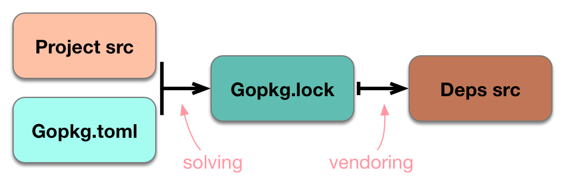
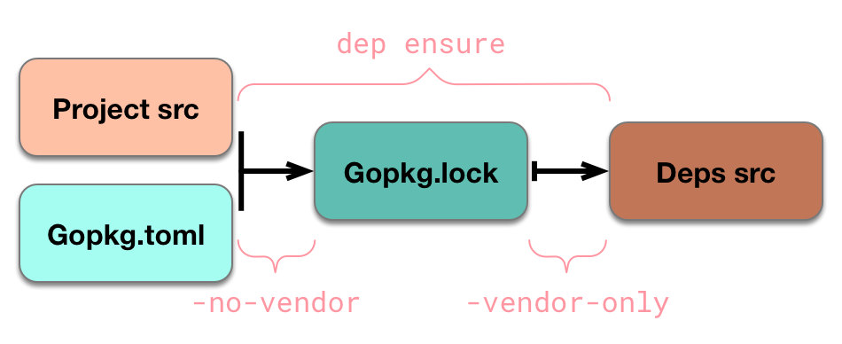
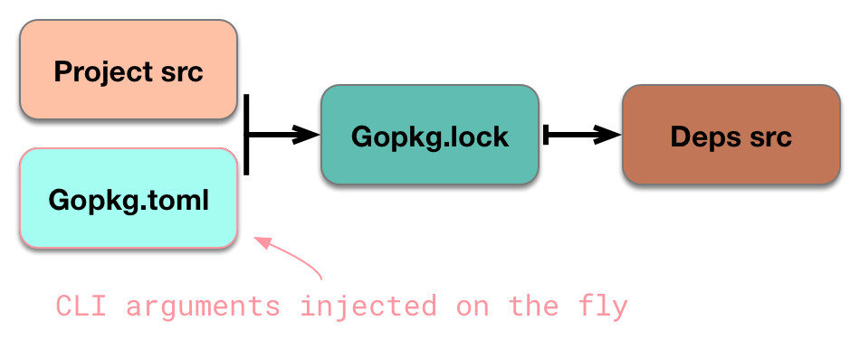
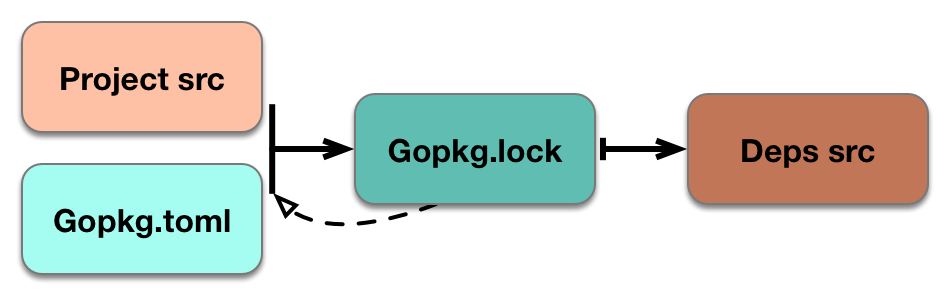

While dep has many discrete components and moving parts, all of these parts revolve around a central model. This document explains that model, then explores the dep's primary mechanisms in the context of that model.

## States and flows

Dep is centered around the idea of the "four state system" - a model for classifying and organizing the on-disk state with which a package manager interacts. This was first articulated as a coherent, general model in [this (long) article](https://medium.com/@sdboyer/so-you-want-to-write-a-package-manager-4ae9c17d9527), though many of the principles in the four state model were derived from existing package managers.

Briefly, the four states are:

1.  The [current project's](glossary.md#current-project) source code.
2.  A [manifest](glossary.md#manifest) - a file describing the current project's dependency requirements. In dep, this is the [`Gopkg.toml`](Gopkg.toml.md) file.
3.  A [lock](glossary.md#lock) - a file containing a transitively-complete, reproducible description of the dependency graph. In dep, this is the [`Gopkg.lock`](Gopkg.lock.md) file.
4.  The source code of the dependences themselves. In dep's current design, this is the `vendor/` directory.

We can visually represent these four states as follows:


### Functional flow

It's useful to think of dep as a system that imposes a unidirectional, functional flow on the relationships between these states. These functions treat the above states as inputs and outputs, moving them from left to right. Specifically, there are two functions:

* A _solving function_, that takes as its input the set of imports in the current project and the rules in `Gopkg.toml`, and returns as its output a transitively-complete, immutable dependency graph - the information in a `Gopkg.lock`.
* A _vendoring function_, that takes the information in a `Gopkg.lock` as its input and ensures an on-disk arrangement of source files such that the compiler will use the versions designated in the lock.

We can represent these two functions visually:



This is `dep ensure` - the typical flow, used when a `Gopkg.toml` already exists. When a project does not yet have a `Gopkg.toml`, `dep init` can generate one. The essential flow remains the same, but with changed inputs: instead of reading from an existing `Gopkg.toml` file, `dep init` constructs one out of data inferred from the user's GOPATH, and/or [a metadata file from another tool](). (In other words, `dep init` automatically migrates a project from other approaches to organizing dependencies.)

This diagram directly corresponds to code as well. The solving function is actually split into a constructor and a method - we first create a [`Solver`](https://godoc.org/github.com/golang/dep/gps#Solver) type, then call its `Solve()` method. The inputs to the constructor are wrapped up in a [`SolveParameters`](https://godoc.org/github.com/golang/dep/gps#SolveParameters), which should look familiar:

```go
type SolveParameters struct {
	RootPackageTree pkgtree.PackageTree // Parsed project src; contains lists of imports
	Manifest gps.RootManifest // Gopkg.toml
	...
}
```

The vendoring function is [`gps.WriteDepTree()`](https://godoc.org/github.com/golang/dep/gps#WriteDepTree). While it takes a handful of arguments, the relevant one is a [`gps.Lock`](https://godoc.org/github.com/golang/dep/gps#Lock) - an interface representing an abstracted form of the data held in a `Gopkg.lock`.

The four state system, and these functional flows through it, are the foundation on which all of dep's behavior is built. If you want to understand dep's mechanics, keep this model at the forefront of your mind.

### Staying in sync

One of dep's design goals is that both of its "functions" minimize both the work they do, and the change they induce in their respective outputs. Consequently, both functions peek ahead at the pre-existing output to understand what work actually needs to be done:

* The solving function checks the existing `Gopkg.lock` to determine if all of its inputs are satisfied. If they are, the solving function can be bypassed entirely. If not, the solving function proceeds, but attempts to change as few of the selections in `Gopkg.lock` as possible.
* The vendoring function hashes each discrete project already in `vendor/` to see if the code present on disk is what `Gopkg.lock` indicates it should be. Only projects with hash mismatches are rewritten.

Specifically, dep defines a number of invariants that must be met:

| Sync invariant                                               | Resolution when desynced                                     | Func       |
| ------------------------------------------------------------ | ------------------------------------------------------------ | ---------- |
| All [`required`](Gopkg.toml.md#required) statements in `Gopkg.toml` must be present in the [`input-imports`](Gopkg.lock.md#input-imports) list in `Gopkg.lock`. | Re-solve, update `Gopkg.lock` and `vendor/` for projects that changed | Solving    |
| All `import` statements in the current project's non-[`ignored`]((Gopkg.toml.md#ignored)), non-hidden packages must be present in [`input-imports`](Gopkg.lock.md#input-imports) list in `Gopkg.lock`. | Re-solve, update `Gopkg.lock` and `vendor/` for projects that changed | Solving    |
| All [versions in `Gopkg.lock`](Gopkg.lock.md#version-information-revision-version-and-branch) must be acceptable with respect to the `[[constraint]]` or `[[override]]` declarations made in `Gopkg.toml`. | Re-solve, update `Gopkg.lock` and `vendor/` for projects that changed | Solving    |
| The [`pruneopts`](Gopkg.lock.md#pruneopts) of each `[[project]]` in `Gopkg.lock` must equal the declaration in `Gopkg.toml`. | Update `Gopkg.lock` and `vendor/`                            | Vendoring* |
| The [`digest`](Gopkg.lock.md#digest) of each `[[project]]` in `Gopkg.lock` must equal the value derived from hashing the current contents of `vendor/` | Regenerate the projects in `vendor/ `, and update `Gopkg.lock` with the new hash digest if necessary | Vendoring  |

(*`pruneopts` is a little weird, because the desync is between `Gopkg.toml` and `Gopkg.lock`, but it doesn't trigger a solve.)

If peeking ahead reveals that the sync invariants are already met, then the corresponding function needn't do any work; if they don't, then dep takes the resolution step. Either way, when `dep ensure` finishes, we can be sure that we're in the "known good state" of where all sync invariants are maintained.

`dep check` will evaluate all of the above relations, and if any invariants do not hold, it will print a description of the desync and exit 1. This behavior can be disabled on a per-project basis using the [`noverify` field in Gopkg.toml](Gopkg.toml.md#noverify).

## `dep ensure` flags and behavior variations

Each of `dep ensure`'s various flags affects the behavior of the solving and vendoring functions - or even whether they run at all. Some flags can also temporarily result in the project being out of sync. Thinking about these effects in the context of dep's basic model is the fastest path to understanding what's going on.

### `-no-vendor` and `-vendor-only`

These two flags are mutually exclusive, and determine which of `dep ensure`'s two functions are actually performed. Passing `-no-vendor` will cause only the solving function to be run, resulting in the creation of a new `Gopkg.lock`; `-vendor-only` will skip solving and run only the vendoring function, causing `vendor/` to be repopulated from the pre-existing `Gopkg.lock`.



Passing `-no-vendor` has the additional effect of causing the solving function to run unconditionally, bypassing the pre-check ordinarily made against `Gopkg.lock` to see if it already satisfies all inputs.

### `-add`

The general purpose of `dep ensure -add` is to facilitate the introduction of new dependencies into the depgraph. Whereas `-update` is restricted to [source roots](glossary.md#source-root), (e.g. `github.com/foo/bar`), `-add` can take any package import path as an argument (e.g. `github.com/foo/bar` OR `github.com/foo/bar/baz`).

Conceptually, there are two possible things that `-add` might be introducing. Any `dep ensure -add` run will do at least one of these:

1.  Running the solving function in order to generate a new `Gopkg.lock` with the new dependenc(ies)
2.  Appending a version constraint into `Gopkg.toml`

This implies two preconditions for `dep ensure -add`, at least one of which must be met:

1.  The named import path is not currently in the project's import statements, or in `Gopkg.toml`'s `required` list
2.  There is no `[[constraint]]` stanza in `Gopkg.toml` for the project root corresponding to the named import path

It is also possible to explicitly specify a version constraint:

```bash
$ dep ensure -add github.com/foo/bar@v1.0.0
```

When no version constraint is included in the argument, the solving function will select the latest version that works (generally, the newest semver release, or the default branch if there are no semver releases). If solving succeeds, then either the argument-specified version, or if none then the version selected by the solver, will be appended into `Gopkg.toml`.

The behavioral variations that arise from the assorted differences in input and current project state are best expressed as a matrix:

| Argument to `dep ensure -add` | Has `[[constraint]]` stanza in `Gopkg.toml` | In imports or `required` | Result                                                                                               |
| ----------------------------- | ------------------------------------------- | ------------------------ | ---------------------------------------------------------------------------------------------------- |
| `github.com/foo/bar`          | N                                           | N                        | Added temporarily to `Gopkg.lock` & `vendor/`; inferred version constraint appended to `Gopkg.toml`  |
| `github.com/foo/bar@v1.0.0`   | N                                           | N                        | Added temporarily to `Gopkg.lock` & `vendor/`; specified version constraint appended to `Gopkg.toml` |
| `github.com/foo/bar`          | Y                                           | N                        | Added temporarily to `Gopkg.lock` & `vendor/`                                                        |
| `github.com/foo/bar@v1.0.0`   | Y                                           | -                        | **Immediate error**: constraint already present in `Gopkg.toml`                                      |
| `github.com/foo/bar`          | N                                           | Y                        | Infer version constraint from `Gopkg.lock` and add to `Gopkg.toml`                                   |
| `github.com/foo/bar`          | Y                                           | Y                        | **Immediate error:** nothing to do                                                                   |

For any of the paths where `dep ensure -add` needs to run the solving function in order to generate an updated `Gopkg.lock`, the relevant information from CLI arguments is applied to the in-memory representation of `Gopkg.toml`:



Import path arguments that need to be added are injected via the `required` list, and if an explicit version requirement was specified, the equivalent of a `[[constraint]]` is created.

Though these rules may ultimately be persisted if solving succeeds, they are ephemeral at least until solving succeeds. And, from the solver's perspective, the ephemeral rules are indistinguishable from rules sourced directly from disk. Thus, to the solver, `dep ensure -add foo@v1.0.0` is identical to modifying `Gopkg.toml` by adding `"foo"` to the `required` list, plus a `[[constraint]]` stanza with `version = "v1.0.0"`, then running `dep ensure`.

However, because these modifications are ephemeral, a successful `dep ensure -add` may actually push the project out of sync. Constraint modifications generally do not, but if the `required` list is modified, then the project will desync. The user is warned accordingly:

```bash
$ dep ensure -add github.com/foo/bar
"github.com/foo/bar" is not imported by your project, and has been temporarily added to Gopkg.lock and vendor/.
If you run "dep ensure" again before actually importing it, it will disappear from Gopkg.lock and vendor/.
```

### `-update`

The behavior of `dep ensure -update` is intimately linked to the behavior of the solver itself. Full detail on that is a topic for the [solver reference material](the-solver.md), but for the purposes of understanding `-update`, we can simplify a bit.

First, to solidify an implication in the discussion of [functional optimizations](#staying-in-sync), the solving function actually takes into account the pre-existing `Gopkg.lock` when it runs:



Injecting `Gopkg.lock` into the solver is a necessity. If we want the solver to preserve previously-selected versions by default, then the solver has to learn about the existing `Gopkg.lock` from somewhere. Otherwise, it wouldn't know what to preserve!

As such, the lock is another one of the properties encoded onto the [previously-discussed]() `SolveParameters` struct. That, plus two other properties, are the salient ones for `-update`:

```go
type SolveParameters struct {
	...
	Lock gps.Lock // Gopkg.lock
	ToChange []gps.ProjectRoot // args to -update
	ChangeAll bool // true if no -update args passed
	...
}
```

Ordinarily, when the solver encounters a project name for which there's an entry in `Gopkg.lock`, it pulls that version out and puts it at the head of the queue of possible versions for that project. When a specific dependency is passed to `dep ensure -update`, however, it is added to the `ToChange` list; when the solver encounters a project listed in `ToChange`, it simply skips pulling the version from the lock.

"Skips pulling the version from the lock" would imply that `dep ensure -update github.com/foo/bar` is equivalent to removing the `[[project]]` stanza for `github.com/foo/bar` from your `Gopkg.lock`, then running `dep ensure`. And indeed it is - however, that approach is not recommended, and subtle changes may be introduced in the future that complicate the equivalency.

If `-update` is passed with no arguments, then `ChangeAll` is set to `true`, resulting in the solver ignoring `Gopkg.lock` for all newly-encountered project names. This is equivalent to explicitly passing all of your dependences as arguments to `dep ensure -update`, as well as `rm Gopkg.lock && dep ensure`. Again, however, neither of these approaches are recommended, and future changes may introduce subtle differences.

When a version hint from `Gopkg.lock` is not placed at the head of the version queue, it means that dep will explore the set of possible versions for a particular dependency. This exploration is performed according to a [fixed sort order](https://godoc.org/github.com/golang/dep/gps#SortForUpgrade), where newer versions are tried first, resulting in an update.

For example, say there is a project, `github.com/foo/bar`, with the following versions:

```bash
v1.2.0, v1.1.1, v1.1.0, v1.0.0, master
```

If we depend on that project with `^1.1.0`, and have `v1.1.0` in our `Gopkg.lock` , then it means there are three versions that match our constraint, and two of them are newer than the one currently selected. (There's also an older version, `v1.0.0`, and a `master` branch, but these aren't allowed by a `^1.1.0` constraint.) An ordinary `dep ensure` run will duplicate and push `v1.1.0` ahead of all the others in the queue:

```bash
[v1.1.0, v1.2.0, v1.1.1, v1.1.0, v1.0.0, master]
```

And `v1.1.0` will be selected again, unless some other condition is presented that forces the solver to discard it. When running `dep ensure -update github.com/foo/bar`, however, the locked version is not prepended:

```bash
[v1.2.0, v1.1.1, v1.1.0, v1.0.0, master]
```

So, barring some other conflict, `v1.2.0` is selected, resulting in the desired update.

#### `-update` and constraint types

Continuing with our example, it's important to note that updates with `-update` are achieved incidentally - the solver never explicitly targets a newer version. It just skips adding a hint from the lock, then selects the first version in the queue that satisfies constraints. Consequently, `-update` is only effective with certain types of constraints.

It does work with branch constraints, which we can observe by including the underlying revision. If the user has constrained on `branch = "master"`, and `Gopkg.lock` points at a topologically older revision (say, `aabbccd`) than the tip of the canonical source's `master` branch (say, `bbccdde`), then `dep ensure` will end up constructing a queue that looks like this:

```bash
[master@aabbccd, v1.1.0, v1.2.0, v1.1.1, v1.1.0, v1.0.0, master@bbccdde]
```

With `-update`, the hint at the head will be omitted; `branch = "master"` will cause the solver to reject all of the semantic versions, and finally settle on `master@bbccdde`.

All versions in the version queue keep track of an underlying revision, which means the same is true if, for example, some upstream project force-pushes a git tag:

```bash
[v1.1.0@aabbccd, v1.1.0, v1.2.0, v1.1.1, v1.1.0@bbccdde, v1.0.0, master]
```

Thus, even if an upstream tag is force-pushed in one of your project's dependences, dep will retain the original revision until you explicitly allow it to change via a `dep ensure -update`.

The key takeaway here is that `-update`'s behavior is governed by the type of constraints specified:

| `Gopkg.toml` version constraint type | Constraint example | `dep ensure -update` behavior                                                                                                             |
| ------------------------------------ | ------------------ | ----------------------------------------------------------------------------------------------------------------------- |
| `version` (semver range)             | `"^1.0.0"`         | Tries to get the latest version allowed by the range                                                               |
| `branch`                             | `"master"`         | Tries to move to the current tip of the named branch                                                                   |
| `version` (non-range semver)         | `"=1.0.0"`         | Change can only occur if the upstream release was moved (e.g. `git push --force <tag>`)                         |
| `version` (non-semver)               | `"foo"`            | Change can only occur if the upstream release was moved                                                         |
| `revision`                           | `aabbccd...`       | No change is possible                                                                                                   |
| (none)                               | (none)             | The first version that works, according to [the sort order](https://godoc.org/github.com/golang/dep/gps#SortForUpgrade) |
